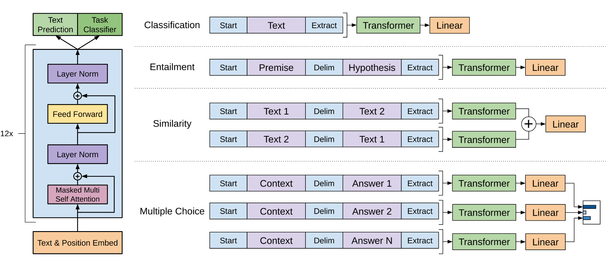

# GPT-1参数量的估计

## 计算公式

### 1. 输入层

输入层包括两个部分，分别是词元嵌入和位置嵌入。假设词元嵌入的维度为$`d_{\text{model}}`$，词典大小为$`V`$，序列长度为$`L`$，则词元嵌入的参数量为$`V \times d_{\text{model}}`$。假设位置嵌入的维度为$`d_{\text{model}}`$，则位置嵌入的参数量为$`L \times d_{\text{model}}`$。因此，输入层的参数量为$`(V + L) \times d_{\text{model}}`$。

### 2. Block

每个Block包括2个`LayerNorm`层，1个`MultiHeadAttention`层和2个`FeedForward`层。

- `MultiHeadAttention`层的包括a）每个head中$`d_k = d_v = d_{\text{model}} / h`$，因此所有head的3个权重矩阵（`Q`、`K`和`V`）参数总共为$`3 \times d_{\text{model}} \times d_{\text{model}}`$及其偏置$`3 \times d_{\text{model}}`$；c）投影矩阵，$`hd_v = d_{\text{model}} \times d_{\text{model}}`$及其偏置$`d_{\text{model}}`$。合计$`4 \times d_{\text{model}}^2 + 4 \times d_{\text{model}}`$。

- `FeedForward`层包括两个线性变换层，每个线性变换层包括权重矩阵和偏置，合计$`8 \times d_{\text{model}}^2 + 5 \times d_{\text{model}}`$。

需要说明的是，GPT-1采用经典的Transformer架构，首先将输入向量通过一个全连接层映射到一个更高维度（$`4 \times d_{\text{model}}`$）的空间，然后再通过一个全连接层映射回原始的维度。

- `LayerNorm`层包括两个参数，即缩放因子和偏置，合计$`2 \times d_{\text{model}}`$。2个`LayerNorm`层合计$`4 \times d_{\text{model}}`$。

因此，一个Block的参数量为$`12 \times d_{\text{model}}^2 + 13 \times d_{\text{model}}`$。

## 3. 输出层
输出层的嵌入和输入层的嵌入是共享的。

## 4. 总参数量
假设Block的数量是$`N`$，总参数量是：

$$(V + L + 13 \times N) \times d_{\text{model}} + 12 \times N \times d_{\text{model}}^2$$

## GPT-1
参考[config.json](https://huggingface.co/openai-community/openai-gpt/blob/main/config.json)的文件，GPT-1的关键参数是：

- $`V = 40478`$
- $`L = 512`$
- $`d_{\text{model}} = 768`$
- $`N = 12`$

代入公式，GPT-1的参数量为116534784，约116.5M。

具体包括，

- 词元嵌入：$`V \times d_{\text{model}} = 31087104`$
- 位置嵌入：$`L \times d_{\text{model}} = 393216`$
- Block：$`N \times (12 \times d_{\text{model}}^2 + 13 \times d_{\text{model}}) = 85054464`$

## 讨论
若使用[minGPT](https://github.com/ckarpathy/minGPT)计算GPT-1的参数量，结果116536320，与本文计算的结果稍有差异。这是因为，`minGPT`的模型设计参考了GPT-2的方法，即在最后一层的输出层之前增加了一个额外的`LayerNorm`层。因此，`minGPT`的参数量比本文计算的结果多了1536（$`2 \times d_{\text{model}}`$）。